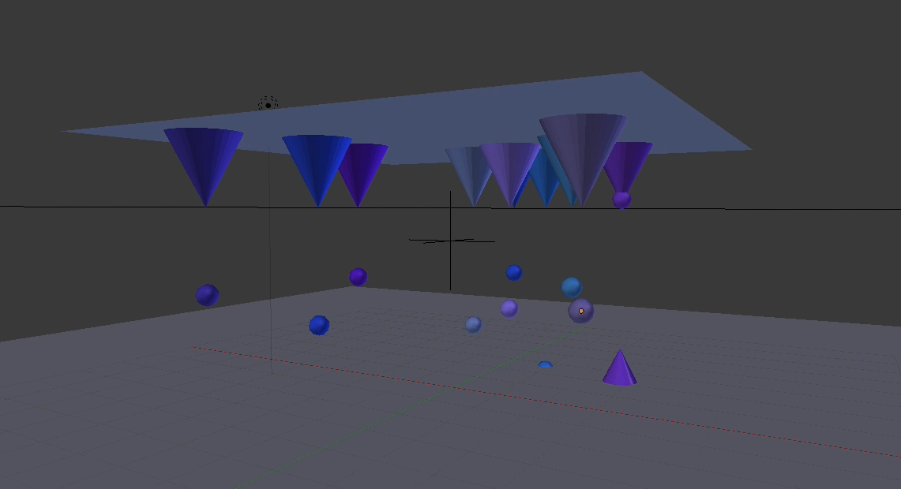
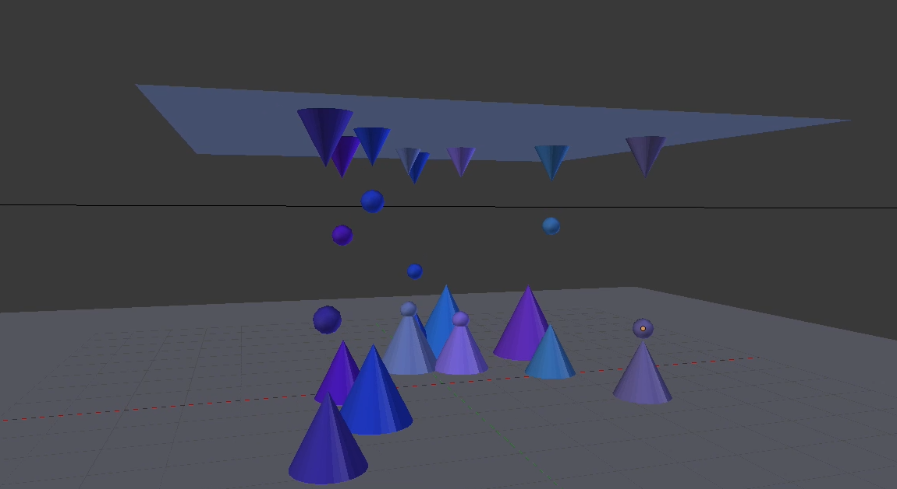
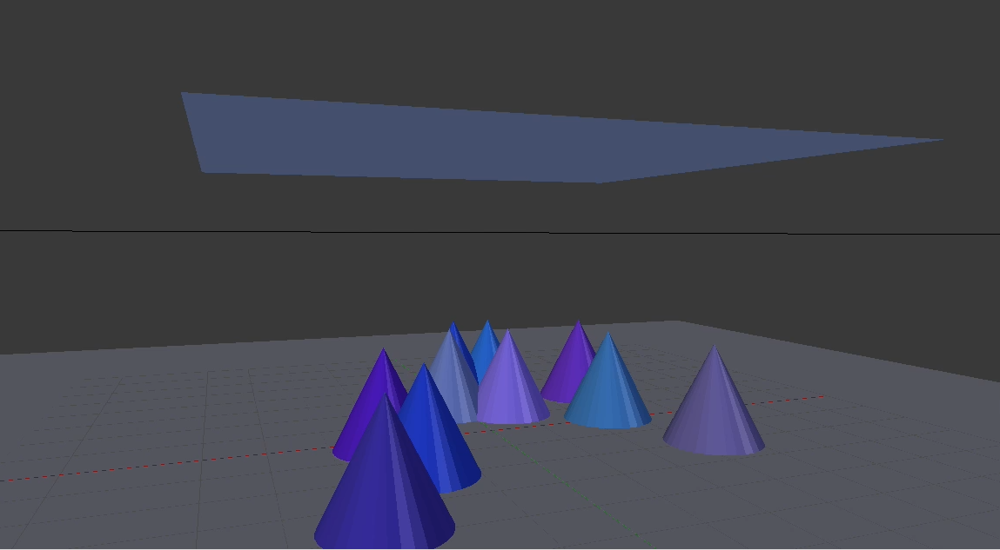

# PyMove3D-Blender-Python-Script
A script i wrote for a competition called PyMove3D

## Beschreibung

Dieses Script erstellt eine Eiszapfenhöhle in welcher anfangs nur Eiszapfen an der Decke hängen. Diese Eiszapfen tropfen jedoch in unterschiedlichen Abständen und erschaffen einen eigenen kleinen "Eishügel" auf dem Boden.
Sobald der oben hängende Eiszapfen zu Ende getropft hat ist der sich am Boden befindene in seiner Maximalgröße und die Animation ist vorbei

## Bilder
Es Befinden sich nur Eiszapfen an der Decke

Die Eiszapfen tropfen und erstellen einen Eishügel auf dem Boden

Die Eiszapfen an der Decke sind verschwunden und es existieren nur noch die auf dem Boden

